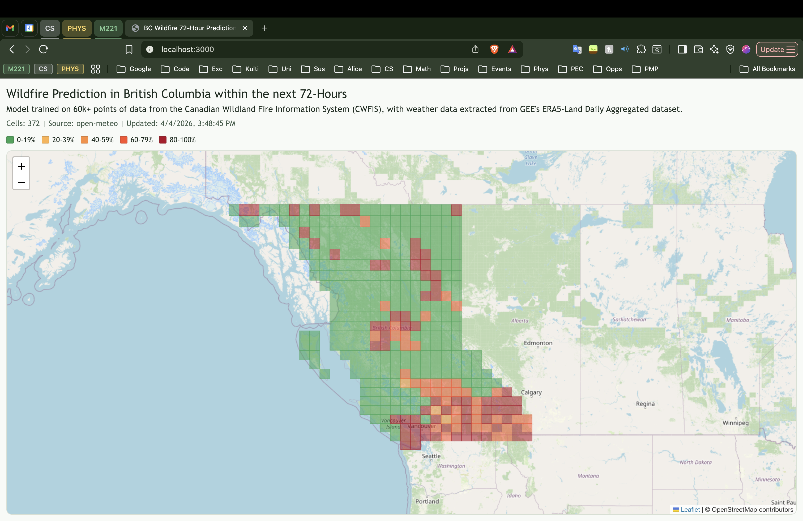

# BC Wildfire Prediction Model and Web-App Visualization

This web-app displays areas in British Columbia with the conditions likely for a Wildfire in the next 72-Hours using live weather data pulled from open-meteo and evaluated through a custom-trained Deep Learning Neural Network designed for Probabilistic Binary Classification.



## Model Details

Data extraction from ECMWF/ERA5_LAND/DAILY_AGGR using Google Earth Engine (GEE). 

3 features recorded for each point:
- Temperature 2m above ground
- Total Precipitation
- Dew point temperature 2m above ground

Fire Database taken from National Fire Database by the Canadian Wildland Fire Information System (CWFIS)
22619 fires occured in BC between 2010-2024

22619 random points in BC was generated over a landmasked area between the months of April and October (wildfire season) and years of 2010-2024. Then for each point, I access GEE and extract the three features.

The data is fed into the neural network into a standard train/test/validation split of 70/15/15. We have 3 layers, going from 16 -> 8 -> 1 nodes, applying a ReLU activation function after each layer. The training epoch is 3000.

These are the following results for the prediction model trained on weather features taken from the same day as the wildfire.

```
==================================================
        BC WILDFIRE MODEL CONFUSION MATRIX        
==================================================
                     | Predicted 0 | Predicted 1
                     | (No Fire)   | (Fire)    
--------------------------------------------------
Actual 0 (No Fire)   | 3230        | 31        
--------------------------------------------------
Actual 1 (Fire)      | 129         | 3321      
==================================================

=====================================================
                Classification Report                
=====================================================
              precision    recall  f1-score   support

     No Fire       0.96      0.99      0.98      3261
        Fire       0.99      0.96      0.98      3450
```

To ensure the model is performing without any overfitting on the datasets, I introduce another test on never-seen-before data, i.e, 2025 BC Wildfire information which was not included in the train/test/validation dataset. Following the same pre-processing steps to introduce weather features to the data, I run the 2025 all-fire dataset through the already-trained model, and achieve these results:

```
============================================
      2025 ALL-FIRE DATASET EVALUATION    
============================================
Total Actual Fires Evaluated        : 1378
Model Predicted as 'Fire' (1)       : 1310
Model Predicted as 'No Fire' (0)    : 68
Recall (Accuracy on Fires)          : 95.07%
```

I then decide to train the model on the weather features three days before the wildfire, producing the following results:

```
==================================================
        BC WILDFIRE MODEL CONFUSION MATRIX        
==================================================
                     | Predicted 0 | Predicted 1
                     | (No Fire)   | (Fire)    
--------------------------------------------------
Actual 0 (No Fire)   | 3278        | 49        
--------------------------------------------------
Actual 1 (Fire)      | 164         | 3220      
==================================================
```

```
=====================================================
                Classification Report                
=====================================================
              precision    recall  f1-score   support

     No Fire       0.95      0.99      0.97      3327
        Fire       0.99      0.95      0.97      3384

    accuracy                           0.97      6711
   macro avg       0.97      0.97      0.97      6711
weighted avg       0.97      0.97      0.97      6711
```

And then when evaluated on the 2025 not-seen-before dataset, I get the following results:
```
=========================================
      2025 ALL-FIRE DATASET EVALUATION    
=========================================
Total Actual Fires Evaluated : 1378
Model Predicted as 'Fire'    : 1305
Model Predicted as 'No Fire' : 73
Recall (Accuracy on Fires)   : 94.70%
```

This shows that there is a clear relationship between weather patterns three days prior to fires, meaning that the model can predict wildfires based on conditions three-days before they occur.

## Web-App Data Pipeline
The app uses a backend-first prediction pipeline so the browser only requests one endpoint and receives map-ready results.

### End-to-end request flow
1. The Next.js page loads and requests `/api/grid-predict` from the Next.js server.
2. The Next.js route handler proxies that request to the FastAPI backend (`/grid-predict`).
3. FastAPI generates a BC grid and removes ocean-dominant cells using `data/bc_land.geojson` (land overlap filtering).
4. Remaining grid cell centroids are chunked into batches and sent to Open-Meteo.
5. Weather features are extracted and normalized into model inputs:
        - precipitation_sum
        - temperature_2m_max
        - dew_point_2m (hourly values averaged per cell)
6. The trained PyTorch model (`wildfire_model.pth`) and fitted scaler (`scaler.joblib`) run batch inference.
7. FastAPI returns each grid cell with:
        - polygon geometry
        - weather values
        - wildfire probability (0-100%)
        - risk label (Low, Moderate, High)
8. The frontend renders polygons with Leaflet and color-codes each cell by probability.

### Performance and reliability controls
- Batched weather requests reduce API call overhead.
- Retry and exponential backoff handle Open-Meteo rate limits.
- `/grid-predict` response caching reduces repeated full recomputation on refresh.
- Null/invalid weather values are guarded before inference.

### Main runtime components
- Frontend: Next.js + React + Leaflet
- Backend: FastAPI + PyTorch + scikit-learn scaler
- External weather source: Open-Meteo forecast API
- Spatial mask: `Model/fast_api/data/bc_land.geojson`

## How to run this project
### 1. Clone and open project
1. Clone this repository.
2. Open the project folder in your editor.

### 2. Backend setup (FastAPI)
1. Open a terminal in `Model/fast_api`.
2. Create and activate a Python virtual environment.
3. Install dependencies.

Suggested commands:

```bash
cd Model/fast_api
python3 -m venv .venv
source .venv/bin/activate
pip install --upgrade pip
pip install fastapi uvicorn torch numpy joblib scikit-learn httpx shapely
```

4. Ensure model artifacts exist in this folder:
   - `wildfire_model.pth`
   - `scaler.joblib`
5. Ensure BC land mask file exists:
   - `data/bc_land.geojson`

### 3. Frontend setup (Next.js)
1. Open a second terminal in `Web-App/bc-wildfire-prediction`.
2. Install Node dependencies.

```bash
cd Web-App/bc-wildfire-prediction
npm install
```

### 4. Run backend
From `Model/fast_api`:

```bash
uvicorn main:app --reload
```

Backend docs:
- http://127.0.0.1:8000/docs

### 5. Run frontend
From `Web-App/bc-wildfire-prediction`:

```bash
npm run dev
```

Frontend app:
- http://localhost:3000

### 6. Verify key endpoints
Backend:
- `GET /` health check
- `GET /grid` grid geometry
- `GET /grid-weather` weather-enriched cells
- `GET /grid-predict` map-ready predictions

Frontend proxy:
- `GET /api/grid-predict`

### 7. Common issues
- If frontend shows loading forever:
  - Verify backend is running on `127.0.0.1:8000`.
  - Open `http://localhost:3000/api/grid-predict` directly and inspect response.
- If backend fails at startup with JSON errors:
  - Validate `Model/fast_api/data/bc_land.geojson` is non-empty valid GeoJSON.
- If weather calls are slow or rate-limited:
  - Increase cache usage and avoid repeated hard refreshes.
  - Tune batch constants in `Model/fast_api/main.py`.

## Limitations
The model seems to be dominated by precipitation weather feature. Areas with no precipitation tend to be flagged as very likely for a fire. This means that in the training set, the model drew a very large connection between 0 precipitation and the likelihood of a wildfire. Model dominance by this single feature is a weakness as it negatively affects prediction accuracy. A future improvement would be the inclusion of more weather features, such as soil moisture. 

In regards to the web-app, the free rate limit for open-meteo presents a big bottleneck, as it limits the number of grids that can be generated, and therefore the more accurate the map will overall be, as more grids = more individual readings = better predictions per area. This can be solved by paying for a open-meteo subscription, which I did not do.